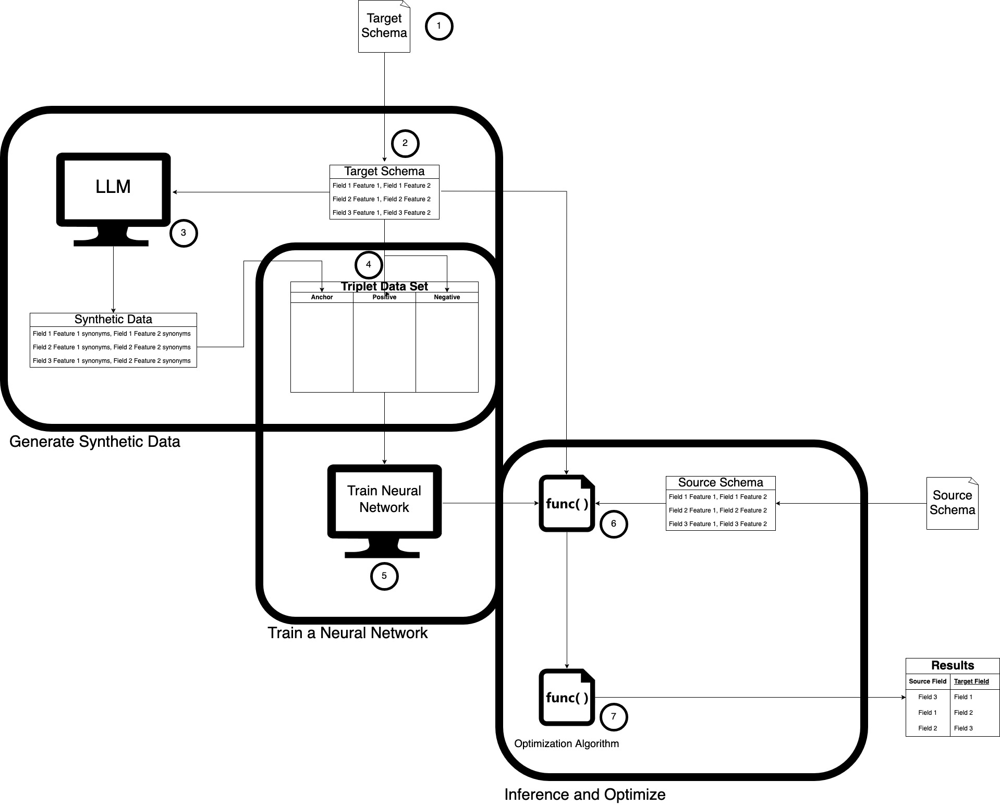

# Data Harmonizer
## Project Organization Summary
    ├── .env <- configure your environment here
    ├── .gitignore
    ├── README.md
    ├── pyproject.toml <- project definition
    ├── uv.lock 
    ├── data
    │   ├── 1_raw
    │   ├── 2_interim
    │   └── 3_processed
    ├── src
    │   └── data_harmonizer
    │       ├── cli
    │       │   └── cli.py <- command line interface
    │       ├── data
    │       │   ├── schema_data.py
    │       │   ├── split_data.py
    │       │   └── synthetic_data.py
    │       ├── modeling
    │       │   └── train.py <- training
    │       ├── __init__.py
    │       └── main.py <- inference
    ├── logs
    ├── models
    └── tests
        ├── test_linkml.yaml   
        ├── test_schema_data.py  
        ├── test_split_data.py 
        └── test_synthetic_data.py

## Description
This project attempts to map fields in a source database to a target database using features extracted from a LinkML schema file.

## Use as command line app
### Installation 
Install the command-line tool with uv:
```bash
uv tool install data-harmonizer
```
### Usage
```bash
data-harmonizer train /path/to/target_linkml.yml -o /path/to/output/

data-harmonizer predict /path/to/target_linkml.yml /path/to/source_linkml.yml /path/to/output/model.ckpt -o /path/to/output
```

## Manual setup
1. Save the project to your local drive.
2. Obtain a API token for [ChatGPT](https://openai.com/api/). Put the API token into the `.env` file under `OPENAI_API_KEY` variable.
3. Put the target LinkML file in `data/1_raw/` folder and name it `target_linkml.yaml`. Alternatively, change the path in the path of the target database using the `.env` file.
3. Run `synthetic_data.py`. This script will take the extracted features from the `target_linkml.yaml` file and create synonyms using ChatGPT.
4. Run `split_data.py`. This script will create a triplet data set from the created synthetic data.
5. Run `train.py`. This script will use the data set and train a Triplet neural network.
6. Put the source LinkML file in `data/1_raw/` folder and name it `source_linkml.yaml`. Alternatively, change the path in the path of the target database using the `.env` file. Run `main.py`

## Background
Below is a diagram explaining how the process works:


1.	The target schema is presented in an approved format (i.e. LinkML format).
2.	Features are extracted from the target schema. In this context, features refer to a property or characteristic of the field that can be used to distinguish the field from other fields. The neural network currently uses the field name and the field description to identify the field.
3.	The features are sent to a large language model to create a set number of synonyms for each text feature. For example, the field name “date_of_birth” could be passed to the large language model and return “dob”. This process would be repeated for the other text fields.
4.	To create the synthetic triplet data set, the features extracted from the target schema are combined with the synonyms produced by the large language model. Each data sample consists of an anchor point, a positive point, and a negative point and each point consists of the features (i.e. field name, field description). The anchor point is derived from the synonym produced using the large language model, the positive point is derived from the field in the target schema used to produce the synonym, and the negative point is any other field in the target schema. All permutations of positive points and negative point are used; therefore, the total number of samples are n * m * (m-1) where n is the number of synonyms and m is the number of fields in the target schema.
5.	The triplet data set is used to train a Triplet neural network (aka Siamese network with a Triplet loss). The goal of the neural network is to minimize the Euclidean distance between similar points (i.e. anchor and positive point) while increasing the Euclidean distance between dissimilar points (i.e. anchor and negative point). Therefore, we would expect fields that are similar should have smaller Euclidean distance
6.	Once the neural network is trained, a source schema can be passed into the network with the intent to match the fields in the source schema to the fields in the target schema. The features are extracted from the source schema. Every field in the target schema is compared to every field in the source schema resulting in a Euclidean distance for each target field, source field pair.
7.	An additional algorithm is used to optimize the matching of each target field to source field. This is an instance of the assignment problem (bipartite matching) that can be solved using the Jonker-Volgenant algorithm (which is a variant of the Hungarian method/Kuhn-Munkres algorithm). The assignment algorithm will create target field, source field pairs that minimize the sum of the Euclidean distance and returns the results.
